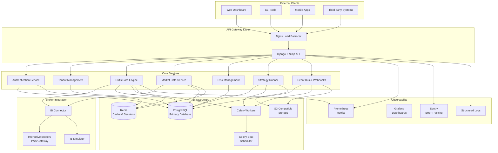
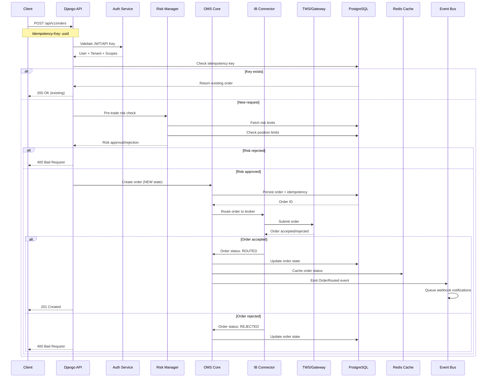
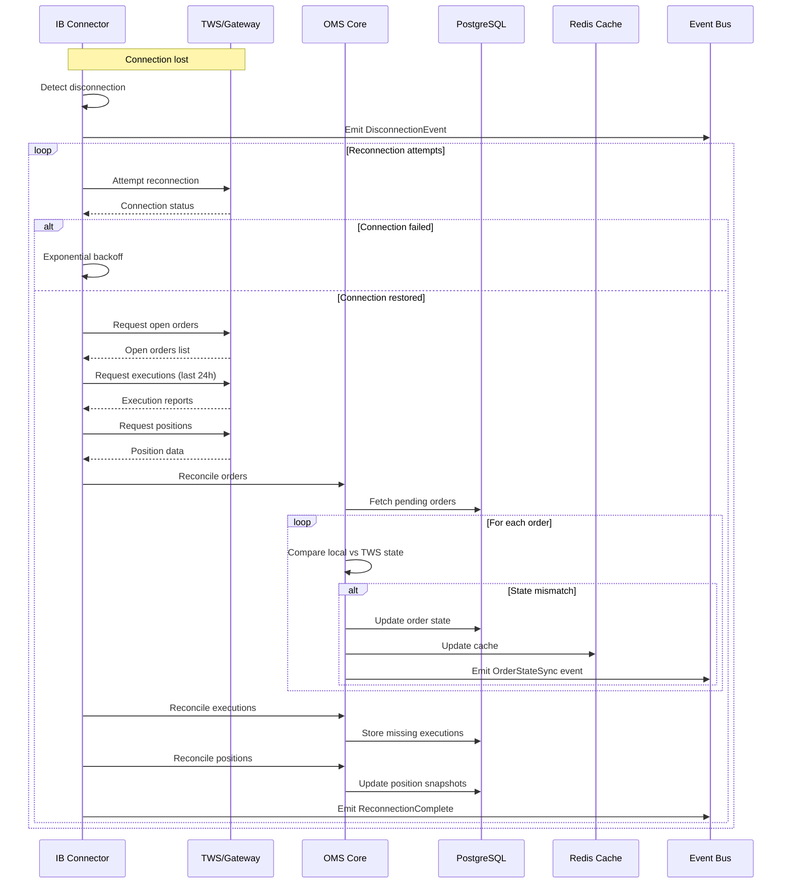
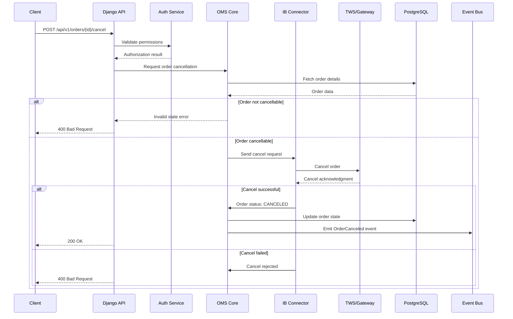
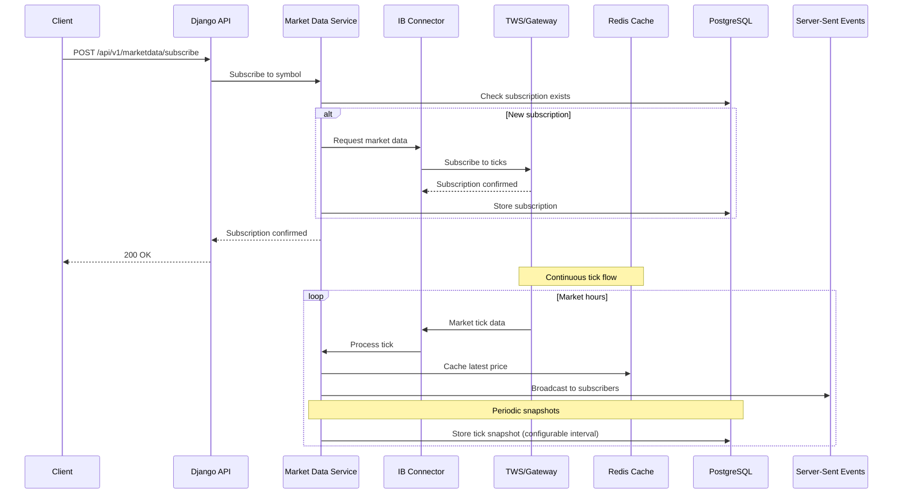

# Order Management System (OMS) - Architecture Design Document

## Table of Contents
1. [System Overview](#system-overview)
2. [System Context Diagram](#system-context-diagram)
3. [Sequence Diagrams](#sequence-diagrams)
4. [Entity Relationship Diagram](#entity-relationship-diagram)
5. [Module & Folder Layout](#module--folder-layout)
6. [Technology Stack & Decisions](#technology-stack--decisions)
7. [Non-Functional Requirements](#non-functional-requirements)
8. [API Surface Design](#api-surface-design)
9. [Security Architecture](#security-architecture)
10. [Deployment Architecture](#deployment-architecture)

## System Overview

The OMS is a production-grade, multi-tenant Order Management System designed for Interactive Brokers integration. It provides a comprehensive trading infrastructure with real-time market data, order routing, risk management, strategy execution, and compliance monitoring.

### Key Features
- Multi-tenant architecture with role-based access control
- Real-time order management with state machine
- Interactive Brokers TWS/Gateway integration via ib_insync
- Market data subscription and caching
- Configurable risk management and compliance rules
- Strategy plugin framework with isolated execution
- Comprehensive audit logging and observability
- Webhook-based event notifications
- Idempotent API design with request deduplication

## System Context Diagram



## Sequence Diagrams

### 1. Place Order Flow



### 2. Reconnect & State Synchronization



### 3. Cancel/Modify Order Flow



### 4. Market Data Subscription & Tick Flow



## Entity Relationship Diagram

```mermaid
erDiagram
    TENANT {
        uuid id PK
        string name
        string subdomain UK
        jsonb settings
        timestamp created_at
        timestamp updated_at
        boolean is_active
    }
    
    USER {
        uuid id PK
        string email UK
        string password_hash
        string first_name
        string last_name
        timestamp created_at
        timestamp updated_at
        boolean is_active
        timestamp last_login
    }
    
    MEMBERSHIP {
        uuid id PK
        uuid tenant_id FK
        uuid user_id FK
        string role
        jsonb permissions
        timestamp created_at
        timestamp updated_at
        boolean is_active
    }
    
    API_KEY {
        uuid id PK
        uuid tenant_id FK
        uuid user_id FK
        string name
        string key_hash
        string key_prefix
        jsonb scopes
        timestamp expires_at
        timestamp created_at
        timestamp last_used_at
        boolean is_active
    }
    
    BROKER {
        uuid id PK
        string name
        string type
        jsonb config
        jsonb credentials_encrypted
        timestamp created_at
        timestamp updated_at
        boolean is_active
    }
    
    BROKER_ACCOUNT {
        uuid id PK
        uuid tenant_id FK
        uuid broker_id FK
        string account_id
        string account_type
        jsonb config
        timestamp created_at
        timestamp updated_at
        boolean is_active
    }
    
    INSTRUMENT {
        uuid id PK
        string symbol UK
        string exchange
        string instrument_type
        string currency
        decimal tick_size
        decimal min_size
        jsonb metadata
        timestamp created_at
        timestamp updated_at
        boolean is_active
    }
    
    ORDER {
        uuid id PK
        uuid tenant_id FK
        uuid user_id FK
        uuid broker_account_id FK
        uuid instrument_id FK
        uuid strategy_run_id FK "nullable"
        string client_order_id UK
        string broker_order_id "nullable"
        string order_type
        string side
        decimal quantity
        decimal price "nullable"
        decimal stop_price "nullable"
        string time_in_force
        string state
        string reject_reason "nullable"
        timestamp submitted_at
        timestamp updated_at
        jsonb metadata
    }
    
    EXECUTION {
        uuid id PK
        uuid tenant_id FK
        uuid order_id FK
        string execution_id UK
        decimal quantity
        decimal price
        decimal commission
        string currency
        timestamp executed_at
        jsonb metadata
    }
    
    POSITION {
        uuid id PK
        uuid tenant_id FK
        uuid broker_account_id FK
        uuid instrument_id FK
        decimal quantity
        decimal avg_cost
        decimal unrealized_pnl
        decimal realized_pnl
        timestamp updated_at
        jsonb metadata
    }
    
    PNL_SNAPSHOT {
        uuid id PK
        uuid tenant_id FK
        uuid broker_account_id FK
        date snapshot_date
        decimal total_unrealized_pnl
        decimal total_realized_pnl
        decimal total_commission
        jsonb positions_snapshot
        timestamp created_at
    }
    
    STRATEGY {
        uuid id PK
        uuid tenant_id FK
        uuid user_id FK
        string name
        string strategy_type
        string version
        jsonb config
        jsonb parameters
        string status
        timestamp created_at
        timestamp updated_at
        boolean is_active
    }
    
    STRATEGY_RUN {
        uuid id PK
        uuid strategy_id FK
        uuid broker_account_id FK
        string run_id UK
        string status
        jsonb runtime_config
        timestamp started_at
        timestamp stopped_at
        jsonb metrics
        string log_path
    }
    
    RISK_LIMIT {
        uuid id PK
        uuid tenant_id FK
        uuid broker_account_id FK "nullable"
        uuid instrument_id FK "nullable"
        string limit_type
        decimal limit_value
        string period
        boolean is_active
        timestamp created_at
        timestamp updated_at
    }
    
    COMPLIANCE_RULE {
        uuid id PK
        uuid tenant_id FK
        string rule_type
        jsonb config
        boolean is_active
        timestamp created_at
        timestamp updated_at
    }
    
    IDEMPOTENCY_KEY {
        uuid id PK
        uuid tenant_id FK
        string key UK
        string endpoint
        string method
        jsonb request_hash
        jsonb response_data
        timestamp created_at
        timestamp expires_at
    }
    
    AUDIT_LOG {
        uuid id PK
        uuid tenant_id FK
        uuid user_id FK "nullable"
        string action
        string resource_type
        string resource_id
        jsonb old_values
        jsonb new_values
        string ip_address
        string user_agent
        timestamp created_at
    }
    
    WEBHOOK_OUT {
        uuid id PK
        uuid tenant_id FK
        string event_type
        string endpoint_url
        string secret_key_hash
        boolean is_active
        integer retry_count
        timestamp created_at
        timestamp updated_at
    }
    
    WEBHOOK_DELIVERY {
        uuid id PK
        uuid webhook_out_id FK
        string event_id
        jsonb payload
        integer attempt_count
        string status
        string response_status
        jsonb response_headers
        string response_body
        timestamp created_at
        timestamp delivered_at
    }
    
    MARKET_SUBSCRIPTION {
        uuid id PK
        uuid tenant_id FK
        uuid instrument_id FK
        string subscription_type
        jsonb config
        timestamp created_at
        timestamp updated_at
        boolean is_active
    }
    
    TICK_DATA {
        uuid id PK
        uuid instrument_id FK
        string tick_type
        decimal price
        integer volume
        timestamp tick_time
        timestamp created_at
    }

    %% Relationships
    TENANT ||--o{ MEMBERSHIP : has
    TENANT ||--o{ API_KEY : has
    TENANT ||--o{ BROKER_ACCOUNT : has
    TENANT ||--o{ ORDER : has
    TENANT ||--o{ EXECUTION : has
    TENANT ||--o{ POSITION : has
    TENANT ||--o{ PNL_SNAPSHOT : has
    TENANT ||--o{ STRATEGY : has
    TENANT ||--o{ RISK_LIMIT : has
    TENANT ||--o{ COMPLIANCE_RULE : has
    TENANT ||--o{ IDEMPOTENCY_KEY : has
    TENANT ||--o{ AUDIT_LOG : has
    TENANT ||--o{ WEBHOOK_OUT : has
    TENANT ||--o{ MARKET_SUBSCRIPTION : has
    
    USER ||--o{ MEMBERSHIP : belongs_to
    USER ||--o{ API_KEY : owns
    USER ||--o{ ORDER : creates
    USER ||--o{ STRATEGY : creates
    
    BROKER ||--o{ BROKER_ACCOUNT : has
    BROKER_ACCOUNT ||--o{ ORDER : routed_to
    BROKER_ACCOUNT ||--o{ POSITION : held_in
    BROKER_ACCOUNT ||--o{ PNL_SNAPSHOT : belongs_to
    BROKER_ACCOUNT ||--o{ STRATEGY_RUN : uses
    
    INSTRUMENT ||--o{ ORDER : for
    INSTRUMENT ||--o{ POSITION : of
    INSTRUMENT ||--o{ MARKET_SUBSCRIPTION : for
    INSTRUMENT ||--o{ TICK_DATA : for
    
    ORDER ||--o{ EXECUTION : generates
    STRATEGY ||--o{ STRATEGY_RUN : has
    STRATEGY_RUN ||--o{ ORDER : creates
    
    WEBHOOK_OUT ||--o{ WEBHOOK_DELIVERY : has
```



## Module & Folder Layout

```
backend/
├── manage.py
├── pyproject.toml
├── Makefile
├── .editorconfig
├── .env.example
├── Dockerfile
├── docker-compose.yml
├── requirements/
│   ├── base.txt
│   ├── dev.txt
│   └── prod.txt
├── apps/
│   ├── __init__.py
│   ├── core/                          # Base functionality
│   │   ├── __init__.py
│   │   ├── settings/
│   │   │   ├── __init__.py
│   │   │   ├── base.py               # Common settings
│   │   │   ├── dev.py                # Development settings
│   │   │   └── prod.py               # Production settings
│   │   ├── models.py                 # Base model mixins
│   │   ├── middleware.py             # Custom middleware
│   │   ├── permissions.py            # Permission classes
│   │   ├── utils.py                  # Utility functions
│   │   ├── exceptions.py             # Custom exceptions
│   │   ├── health.py                 # Health check views
│   │   └── logging.py                # Logging configuration
│   ├── accounts/                      # Authentication & Users
│   │   ├── __init__.py
│   │   ├── models.py                 # User, ApiKey models
│   │   ├── managers.py               # Custom managers
│   │   ├── serializers.py            # DRF serializers
│   │   ├── schemas.py                # Ninja schemas
│   │   ├── views.py                  # DRF views (if needed)
│   │   ├── api.py                    # Ninja API routes
│   │   ├── services.py               # Business logic
│   │   ├── permissions.py            # Account permissions
│   │   ├── signals.py                # Django signals
│   │   ├── admin.py                  # Django admin
│   │   └── tests/
│   │       ├── __init__.py
│   │       ├── test_models.py
│   │       ├── test_api.py
│   │       └── test_services.py
│   ├── tenants/                       # Multi-tenancy
│   │   ├── __init__.py
│   │   ├── models.py                 # Tenant, Membership
│   │   ├── managers.py               # Tenant-aware managers
│   │   ├── schemas.py                # Ninja schemas
│   │   ├── api.py                    # Ninja API routes
│   │   ├── services.py               # Tenant services
│   │   ├── middleware.py             # Tenant resolution
│   │   ├── signals.py                # Auto-scoping signals
│   │   ├── admin.py                  # Tenant admin
│   │   └── tests/
│   ├── brokers/                       # Broker integrations
│   │   ├── __init__.py
│   │   ├── models.py                 # Broker, BrokerAccount
│   │   ├── schemas.py                # Ninja schemas
│   │   ├── api.py                    # Ninja API routes
│   │   ├── base/
│   │   │   ├── __init__.py
│   │   │   ├── connector.py          # Abstract broker interface
│   │   │   ├── exceptions.py         # Broker exceptions
│   │   │   └── utils.py              # Common utilities
│   │   ├── ib/
│   │   │   ├── __init__.py
│   │   │   ├── connector.py          # IB connector implementation
│   │   │   ├── mapping.py            # OMS ↔ IB mapping
│   │   │   ├── events.py             # Event handlers
│   │   │   ├── sim.py                # IB simulator for testing
│   │   │   └── config.py             # IB-specific config
│   │   ├── services.py               # Broker services
│   │   ├── tasks.py                  # Celery tasks
│   │   ├── admin.py                  # Broker admin
│   │   └── tests/
│   ├── marketdata/                    # Market data management
│   │   ├── __init__.py
│   │   ├── models.py                 # Instrument, Subscription, Tick
│   │   ├── schemas.py                # Ninja schemas
│   │   ├── api.py                    # Ninja API routes
│   │   ├── services.py               # Market data services
│   │   ├── cache.py                  # Redis caching layer
│   │   ├── streaming.py              # SSE/WebSocket streaming
│   │   ├── tasks.py                  # Celery tasks
│   │   ├── admin.py                  # Market data admin
│   │   └── tests/
│   ├── oms/                          # Order Management System
│   │   ├── __init__.py
│   │   ├── models.py                 # Order, Execution, Position, etc.
│   │   ├── schemas.py                # Ninja schemas
│   │   ├── api.py                    # Ninja API routes
│   │   ├── state_machine.py          # Order state machine
│   │   ├── services/
│   │   │   ├── __init__.py
│   │   │   ├── order_router.py       # Order routing logic
│   │   │   ├── risk_manager.py       # Risk management
│   │   │   ├── compliance.py         # Compliance checks
│   │   │   ├── reconciliation.py     # State reconciliation
│   │   │   └── position_manager.py   # Position management
│   │   ├── tasks.py                  # Celery tasks
│   │   ├── signals.py                # Django signals
│   │   ├── admin.py                  # OMS admin
│   │   └── tests/
│   ├── strategies/                    # Strategy management
│   │   ├── __init__.py
│   │   ├── models.py                 # Strategy, StrategyRun
│   │   ├── schemas.py                # Ninja schemas
│   │   ├── api.py                    # Ninja API routes
│   │   ├── base.py                   # BaseStrategy interface
│   │   ├── runner.py                 # Strategy runner service
│   │   ├── examples/
│   │   │   ├── __init__.py
│   │   │   ├── echo_strategy.py      # Echo strategy for testing
│   │   │   └── vwap_demo.py          # VWAP demo strategy
│   │   ├── sandbox.py                # Strategy sandboxing
│   │   ├── tasks.py                  # Celery tasks
│   │   ├── admin.py                  # Strategy admin
│   │   └── tests/
│   ├── events/                        # Event system & webhooks
│   │   ├── __init__.py
│   │   ├── models.py                 # WebhookOut, WebhookDelivery
│   │   ├── schemas.py                # Ninja schemas
│   │   ├── api.py                    # Ninja API routes
│   │   ├── bus.py                    # Event bus implementation
│   │   ├── webhook_sender.py         # Outgoing webhook service
│   │   ├── webhook_receiver.py       # Incoming webhook handler
│   │   ├── tasks.py                  # Celery tasks
│   │   ├── admin.py                  # Events admin
│   │   └── tests/
│   └── api/                          # API configuration
│       ├── __init__.py
│       ├── ninja_api.py              # Main Ninja API setup
│       ├── drf_compat.py             # DRF compatibility layer
│       ├── middleware.py             # API middleware
│       ├── throttling.py             # Rate limiting
│       ├── pagination.py             # Pagination classes
│       └── urls.py                   # URL configuration
├── libs/                             # Reusable libraries
│   ├── __init__.py
│   ├── ibsdk/                        # IB SDK wrapper
│   │   ├── __init__.py
│   │   ├── client.py                 # Enhanced ib_insync client
│   │   ├── contracts.py              # Contract utilities
│   │   ├── orders.py                 # Order utilities
│   │   ├── events.py                 # Event handling
│   │   ├── reconnect.py              # Reconnection logic
│   │   ├── sim.py                    # Simulation utilities
│   │   └── tests/
│   └── shared/                       # Shared utilities
│       ├── __init__.py
│       ├── schemas.py                # Common schemas
│       ├── enums.py                  # Enumerations
│       ├── dto.py                    # Data transfer objects
│       ├── validators.py             # Custom validators
│       ├── encryption.py             # Encryption utilities
│       └── time_utils.py             # Time utilities
├── infra/                            # Infrastructure
│   ├── docker/
│   │   ├── Dockerfile.web
│   │   ├── Dockerfile.worker
│   │   └── Dockerfile.ib-gateway
│   ├── compose/
│   │   ├── docker-compose.yml
│   │   ├── docker-compose.prod.yml
│   │   └── docker-compose.test.yml
│   ├── k8s/                          # Kubernetes manifests
│   ├── terraform/                    # Infrastructure as code
│   ├── migrations/
│   └── scripts/
│       ├── entrypoint.sh
│       ├── wait-for-it.sh
│       └── init-db.sh
└── tests/                            # Integration tests
    ├── __init__.py
    ├── conftest.py                   # Pytest configuration
    ├── fixtures/                     # Test fixtures
    ├── integration/                  # Integration tests
    ├── e2e/                         # End-to-end tests
    └── performance/                  # Performance tests
```

## Technology Stack & Decisions

### Core Framework
- **Django 5.x**: Robust ORM, admin interface, security features
- **Django Ninja**: Modern API framework with automatic OpenAPI generation
- **Django REST Framework**: Permission classes and serializers for compatibility

### Database & Caching
- **PostgreSQL 15+**: ACID compliance, JSON support, performance
- **Redis 7+**: Caching, session storage, Celery broker

### Task Queue
- **Celery**: Distributed task processing
- **Celery Beat**: Periodic task scheduling

### Broker Integration
- **ib_insync**: Asynchronous Interactive Brokers API client
- **Custom connector layer**: Abstraction for multiple broker support

### Authentication & Security
- **JWT tokens**: Stateless authentication
- **API keys**: Machine-to-machine authentication
- **Scoped permissions**: Fine-grained access control
- **HMAC signing**: Webhook payload verification

### Observability
- **Structured logging**: JSON format with correlation IDs
- **Prometheus metrics**: Custom business metrics
- **Sentry**: Error tracking and performance monitoring
- **Health checks**: Kubernetes-compatible endpoints

### Development & Deployment
- **Docker**: Containerization
- **Docker Compose**: Local development
- **Poetry/pip-tools**: Dependency management
- **GitHub Actions**: CI/CD pipeline
- **Kubernetes**: Production deployment

### Rationale for Key Decisions

#### Django Ninja over FastAPI
- Leverage Django's mature ecosystem (ORM, admin, auth)
- Automatic OpenAPI generation with type hints
- Seamless integration with existing Django patterns
- Better multi-tenancy support through Django's features

#### ib_insync over Native IB API
- Pythonic async interface
- Built-in reconnection handling
- Event-driven architecture
- Active community support

#### Multi-tenant Architecture
- Single database with tenant isolation via foreign keys
- Prepares for future row-level security (RLS)
- Simpler deployment and maintenance than database-per-tenant
- Better resource utilization

#### State Machine for Orders
- Explicit state transitions prevent invalid states
- Audit trail of state changes
- Simplified error handling and recovery
- Clear business logic flow

#### Event-Driven Architecture
- Loose coupling between components
- Scalable notification system
- Audit trail for compliance
- Integration-friendly via webhooks

## Non-Functional Requirements

### Performance Targets
- **API Response Time**: <150ms for non-broker operations (95th percentile)
- **Order Placement**: <500ms end-to-end including broker submission
- **Market Data Latency**: <100ms from broker to cache
- **Throughput**: 1000+ orders per minute per tenant
- **Concurrent Users**: 100+ concurrent API sessions

### Reliability & Availability
- **Uptime**: 99.9% availability during market hours
- **Recovery Time**: <60 seconds for automatic failover
- **Data Durability**: Zero data loss for order and execution records
- **Graceful Degradation**: Continue operation with limited broker connectivity

### Scalability
- **Horizontal Scaling**: Stateless application servers
- **Database Scaling**: Read replicas for reporting queries
- **Queue Scaling**: Multiple Celery workers per service
- **Storage Scaling**: S3-compatible object storage for logs/artifacts

### Security
- **Authentication**: Multi-factor authentication support
- **Authorization**: Role-based access control with principle of least privilege
- **Encryption**: TLS 1.3 for transport, AES-256 for data at rest
- **Audit Logging**: Complete audit trail for compliance
- **Secret Management**: External secret store (HashiCorp Vault compatible)

### Monitoring & Observability
- **Metrics Collection**: Prometheus-compatible metrics
- **Log Aggregation**: Structured JSON logs with correlation IDs
- **Distributed Tracing**: Request tracing across services
- **Alerting**: PagerDuty integration for critical issues
- **SLA Monitoring**: Business metric dashboards

### Compliance & Risk Management
- **Order Validation**: Pre-trade risk checks with configurable limits
- **Position Monitoring**: Real-time position and P&L tracking
- **Regulatory Reporting**: Audit trails for regulatory compliance
- **Circuit Breakers**: Automatic trading halts on risk threshold breaches
- **Backup & Recovery**: Point-in-time recovery for all critical data

### Operational Requirements
- **Zero-Downtime Deployments**: Blue-green deployment strategy
- **Configuration Management**: Environment-based configuration
- **Health Checks**: Liveness and readiness probes
- **Graceful Shutdown**: Safe termination of in-flight operations
- **Disaster Recovery**: Cross-region backup and recovery procedures

## API Surface Design

### Authentication Endpoints
```
POST   /api/v1/auth/register          # User registration
POST   /api/v1/auth/login             # JWT token generation
POST   /api/v1/auth/refresh           # Token refresh
POST   /api/v1/auth/logout            # Token invalidation
POST   /api/v1/auth/rotate-api-key    # API key rotation
GET    /api/v1/auth/profile           # User profile
PUT    /api/v1/auth/profile           # Update profile
```

### Tenant Management
```
GET    /api/v1/tenants                # List tenants (admin)
POST   /api/v1/tenants                # Create tenant
GET    /api/v1/tenants/{id}           # Get tenant details
PUT    /api/v1/tenants/{id}           # Update tenant
POST   /api/v1/tenants/{id}/invite    # Invite member
GET    /api/v1/tenants/{id}/members   # List members
PUT    /api/v1/tenants/{id}/members/{user_id}  # Update member role
DELETE /api/v1/tenants/{id}/members/{user_id}  # Remove member
```

### Broker Management
```
GET    /api/v1/brokers                # List available brokers
GET    /api/v1/brokers/{id}           # Get broker details
POST   /api/v1/brokers/ib/connect     # Connect to IB TWS
GET    /api/v1/brokers/ib/status      # Get connection status
POST   /api/v1/brokers/ib/disconnect  # Disconnect from IB TWS
GET    /api/v1/brokers/ib/accounts    # List IB accounts
```

### Market Data
```
GET    /api/v1/instruments            # List instruments
GET    /api/v1/instruments/{symbol}   # Get instrument details
POST   /api/v1/marketdata/subscribe   # Subscribe to market data
DELETE /api/v1/marketdata/subscribe   # Unsubscribe from market data
GET    /api/v1/marketdata/subscriptions # List active subscriptions
GET    /api/v1/marketdata/last/{symbol}   # Get last price
GET    /api/v1/marketdata/stream      # Server-sent events stream
```

### Order Management
```
POST   /api/v1/orders                 # Place new order (idempotent)
GET    /api/v1/orders                 # List orders (with filters)
GET    /api/v1/orders/{id}            # Get order details
POST   /api/v1/orders/{id}/cancel     # Cancel order
POST   /api/v1/orders/{id}/modify     # Modify order
GET    /api/v1/orders/{id}/executions # Get order executions
```

### Position & P&L
```
GET    /api/v1/positions              # Get current positions
GET    /api/v1/positions/{symbol}     # Get position for symbol
GET    /api/v1/pnl/today             # Today's P&L summary
GET    /api/v1/pnl/history           # Historical P&L
GET    /api/v1/executions             # List executions
```

### Strategy Management
```
GET    /api/v1/strategies             # List strategies
POST   /api/v1/strategies             # Create strategy
GET    /api/v1/strategies/{id}        # Get strategy details
PUT    /api/v1/strategies/{id}        # Update strategy
DELETE /api/v1/strategies/{id}        # Delete strategy
POST   /api/v1/strategies/{id}/start  # Start strategy run
POST   /api/v1/strategies/{id}/stop   # Stop strategy run
GET    /api/v1/strategies/{id}/runs   # List strategy runs
GET    /api/v1/strategies/{id}/logs   # Download strategy logs
```

### Risk Management
```
GET    /api/v1/risk/limits            # List risk limits
POST   /api/v1/risk/limits            # Create risk limit
PUT    /api/v1/risk/limits/{id}       # Update risk limit
DELETE /api/v1/risk/limits/{id}       # Delete risk limit
GET    /api/v1/risk/status            # Current risk status
POST   /api/v1/risk/override          # Override risk check (admin)
```

### Webhooks
```
GET    /api/v1/webhooks/out           # List outgoing webhooks
POST   /api/v1/webhooks/out           # Create webhook endpoint
PUT    /api/v1/webhooks/out/{id}      # Update webhook
DELETE /api/v1/webhooks/out/{id}      # Delete webhook
GET    /api/v1/webhooks/out/{id}/deliveries # List delivery attempts
POST   /api/v1/webhooks/in            # Incoming webhook receiver
```

### System & Health
```
GET    /api/v1/health                 # Health check
GET    /api/v1/health/ready           # Readiness check
GET    /api/v1/metrics                # Prometheus metrics
GET    /api/v1/version                # API version info
```

### API Features
- **Versioning**: URL-based versioning (v1, v2, etc.)
- **Authentication**: JWT Bearer tokens or API key headers
- **Rate Limiting**: Per-tenant and per-API-key limits
- **Pagination**: Cursor-based pagination for large datasets
- **Filtering**: Query parameter filters for list endpoints
- **Sorting**: Configurable sort orders
- **Field Selection**: Sparse fieldsets via query parameters
- **Bulk Operations**: Batch order placement and cancellation
- **Idempotency**: Idempotency keys for order-creating operations
- **Real-time Updates**: Server-sent events for live data

## Security Architecture

### Authentication & Authorization
- **JWT Tokens**: Short-lived access tokens (15 minutes) with refresh tokens (7 days)
- **API Keys**: Long-lived machine tokens with configurable scopes
- **Multi-Factor Authentication**: TOTP support for enhanced security
- **Role-Based Access Control**: Hierarchical permissions (Admin → Manager → Trader → Viewer)

### Scope-Based Permissions
```
auth:login          # Authentication operations
tenants:admin       # Full tenant administration
tenants:manage      # Manage tenant settings
brokers:connect     # Connect/disconnect brokers
brokers:view        # View broker status
orders:place        # Place new orders
orders:cancel       # Cancel orders
orders:modify       # Modify orders
orders:view         # View orders and executions
positions:view      # View positions and P&L
strategies:manage   # Create/update/delete strategies
strategies:run      # Start/stop strategy runs
strategies:view     # View strategy details
risk:override       # Override risk checks
marketdata:subscribe # Subscribe to market data
webhooks:manage     # Manage webhook endpoints
system:admin        # System administration
```

### Data Protection
- **Encryption at Rest**: AES-256 encryption for sensitive data
- **Encryption in Transit**: TLS 1.3 for all API communications
- **Secret Management**: External secret store integration
- **Credential Rotation**: Automated rotation of broker credentials
- **Data Masking**: Sensitive data masking in logs and admin interface

### Network Security
- **API Gateway**: Centralized entry point with WAF protection
- **CORS Configuration**: Strict cross-origin resource sharing policies
- **IP Allowlisting**: Optional IP-based access restrictions
- **Rate Limiting**: Configurable rate limits per endpoint and tenant
- **DDoS Protection**: Application-level DDoS mitigation

### Audit & Compliance
- **Complete Audit Trail**: All actions logged with user attribution
- **Immutable Logs**: Tamper-evident logging with cryptographic signatures
- **Data Retention**: Configurable retention policies for compliance
- **Privacy Controls**: GDPR-compliant data handling and deletion
- **Regulatory Reporting**: Audit trail export for regulatory requirements

## Deployment Architecture

### Container Strategy
- **Multi-stage Builds**: Optimized Docker images with security scanning
- **Distroless Images**: Minimal attack surface with distroless base images
- **Health Checks**: Container health checks for orchestrator integration
- **Resource Limits**: CPU and memory limits for predictable performance

### Service Architecture
```
Load Balancer (nginx)
├── Web Application (Django + Ninja)
├── Celery Workers
│   ├── Order Processing Workers
│   ├── Market Data Workers
│   ├── Strategy Execution Workers
│   └── Webhook Delivery Workers
├── Celery Beat (Scheduler)
├── Celery Flower (Monitoring)
└── Background Services
    ├── IB Connector Service
    ├── Market Data Streamer
    └── Reconciliation Service
```

### Database Architecture
- **Primary Database**: PostgreSQL with streaming replication
- **Read Replicas**: Separate read replicas for reporting and analytics
- **Connection Pooling**: PgBouncer for connection management
- **Backup Strategy**: Continuous WAL archival with point-in-time recovery

### Caching Strategy
- **Application Cache**: Redis for session storage and API caching
- **Market Data Cache**: Redis with pub/sub for real-time data distribution
- **Query Caching**: Database query result caching for expensive operations
- **CDN Integration**: Static asset delivery via CDN

### Monitoring & Observability
- **Metrics**: Prometheus with custom business metrics
- **Logging**: Centralized logging with ELK stack or similar
- **Tracing**: Distributed tracing with Jaeger or equivalent
- **Alerting**: Multi-channel alerting with escalation policies
- **Dashboards**: Grafana dashboards for operational metrics

This architecture provides a solid foundation for a production-grade OMS with emphasis on reliability, security, performance, and maintainability. The design supports horizontal scaling and provides clear separation of concerns while maintaining strong consistency for financial data.
