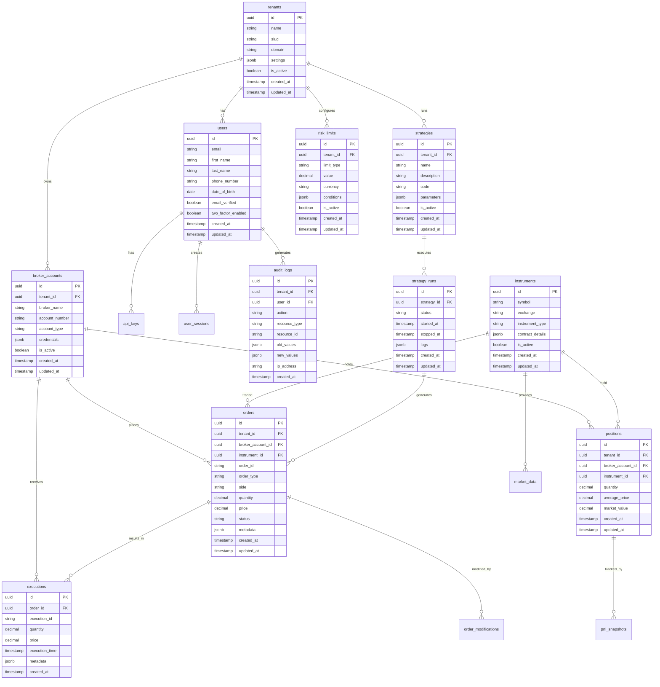

# OMS Trading System - Project Architecture & Implementation Guide

## Project Overview

The OMS Trading System is a production-grade, multi-tenant Order Management System (OMS) designed specifically for Interactive Brokers (TWS/Gateway). This system provides a comprehensive platform for managing trading operations, strategies, and market data with enterprise-grade reliability and security.

## System Goals

### Primary Objectives
- **Multi-tenant Architecture**: Support multiple trading firms/teams with isolated data and operations
- **Interactive Brokers Integration**: Seamless connectivity to IB TWS and Gateway with auto-reconnection
- **Order Management**: Complete order lifecycle from placement to execution and position tracking
- **Risk Management**: Pre-trade and real-time risk controls with configurable limits
- **Strategy Execution**: Plugin-based strategy framework for automated trading
- **Market Data**: Real-time market data subscription and caching
- **Compliance**: Built-in compliance rules and audit trails
- **API-First Design**: RESTful API with OpenAPI documentation for integration

### Target Users
- **Trading Firms**: Multi-strategy firms managing multiple accounts
- **Portfolio Managers**: Individual managers with specific trading mandates
- **Quantitative Traders**: Algorithm developers and strategy researchers
- **Compliance Officers**: Risk and compliance monitoring personnel

## System Architecture

### High-Level System Context


### Core Components

#### 1. **API Gateway (Django + Ninja)**
- **Primary API**: Django Ninja for high-performance, OpenAPI-compliant endpoints
- **DRF Compatibility**: Django REST Framework for complex ViewSets and permissions
- **Authentication**: JWT tokens with refresh mechanism
- **Authorization**: Role-based access control with fine-grained permissions
- **Rate Limiting**: Per-API-key rate limiting with configurable quotas

#### 2. **OMS Core Engine**
- **Order State Machine**: NEW → ROUTED → PARTIALLY_FILLED → FILLED | REJECTED | CANCELED
- **Order Router**: Intelligent routing to appropriate broker accounts
- **Position Management**: Real-time position tracking and P&L calculation
- **Execution Management**: Fill reconciliation and execution reporting

#### 3. **Risk Management System**
- **Pre-trade Checks**: Notional limits, symbol restrictions, order frequency limits
- **Real-time Monitoring**: Position limits, drawdown monitoring
- **Configurable Rules**: Tenant-specific risk parameters
- **Emergency Controls**: Circuit breakers and position liquidation

#### 4. **Compliance Engine**
- **Wash Trading Prevention**: Detection and prevention of wash trades
- **Restricted Hours**: Trading hour restrictions and holiday calendars
- **Throttling**: Order rate limiting and cooldown periods
- **Audit Trail**: Complete audit logging for regulatory compliance

#### 5. **Broker Integration**
- **IB TWS/Gateway**: Primary broker connection using ib_insync
- **Auto-reconnection**: Resilient connection management with exponential backoff
- **State Synchronization**: Position and order reconciliation after disconnections
- **Simulation Mode**: Local IB simulator for development and testing

#### 6. **Strategy Framework**
- **Plugin Architecture**: Extensible strategy interface with lifecycle hooks
- **Strategy Runner**: Celery-based execution engine
- **Sandboxing**: Isolated execution environment for safety
- **Paper Trading**: Built-in paper trading mode for strategy validation

## Data Architecture

### Entity Relationship Diagram



## Technology Stack

### Backend Framework
- **Django 5**: Core web framework with modern async support
- **Django Ninja**: High-performance API framework with OpenAPI generation
- **Django REST Framework**: For complex ViewSets and permission classes

### Database & Caching
- **PostgreSQL 15+**: Primary database with advanced features
- **Redis 7+**: Caching, session storage, and Celery broker
- **Connection Pooling**: Optimized database connections

### Message Queue & Background Tasks
- **Celery**: Asynchronous task processing
- **Redis**: Message broker and result backend
- **Celery Beat**: Scheduled task execution
- **Flower**: Celery monitoring and management

### Interactive Brokers Integration
- **ib_insync**: Modern Python library for IB TWS/Gateway
- **Async Event Loop**: Non-blocking IB communication
- **Auto-reconnection**: Resilient connection management
- **State Synchronization**: Position and order reconciliation

### Security & Authentication
- **JWT Tokens**: Access and refresh token mechanism
- **API Keys**: Scoped API keys for machine-to-machine communication
- **Role-Based Access Control**: Fine-grained permission system
- **Two-Factor Authentication**: Optional 2FA for enhanced security

### Monitoring & Observability
- **Structured Logging**: JSON-formatted logs for easy parsing
- **Health Checks**: Comprehensive system health monitoring
- **Metrics**: Prometheus-compatible metrics endpoints
- **Request Tracing**: Request ID propagation for debugging

## API Design

### Authentication Endpoints
```
POST /api/v1/auth/register          # User registration
POST /api/v1/auth/login             # User login
POST /api/v1/auth/refresh           # Token refresh
POST /api/v1/auth/logout            # User logout
POST /api/v1/auth/rotate-api-key    # API key rotation
```

### Order Management
```
POST /api/v1/orders                 # Place new order (idempotent)
GET  /api/v1/orders                 # List orders with filters
GET  /api/v1/orders/{id}            # Get order details
POST /api/v1/orders/{id}/cancel     # Cancel order
POST /api/v1/orders/{id}/modify     # Modify order
```

### Position & P&L
```
GET  /api/v1/positions              # Current positions
GET  /api/v1/pnl/today              # Daily P&L summary
GET  /api/v1/pnl/history            # Historical P&L data
```

### Broker Management
```
POST /api/v1/brokers/ib/connect     # Connect to IB
GET  /api/v1/brokers/ib/status      # Connection status
POST /api/v1/brokers/ib/disconnect  # Disconnect from IB
```

### Market Data
```
POST /api/v1/marketdata/subscribe    # Subscribe to market data
POST /api/v1/marketdata/unsubscribe  # Unsubscribe from market data
GET  /api/v1/marketdata/last/{symbol} # Last price for symbol
```

### Strategy Management
```
GET    /api/v1/strategies           # List strategies
POST   /api/v1/strategies           # Create strategy
GET    /api/v1/strategies/{id}      # Get strategy details
PUT    /api/v1/strategies/{id}      # Update strategy
DELETE /api/v1/strategies/{id}      # Delete strategy
POST   /api/v1/strategies/{id}/start # Start strategy
POST   /api/v1/strategies/{id}/stop  # Stop strategy
```

## Security Model

### Authentication Levels
1. **JWT Tokens**: User authentication with configurable expiration
2. **API Keys**: Machine-to-machine authentication with scoped permissions
3. **Session Management**: Secure session handling with IP tracking

### Permission Scopes
- `view:orders` - View order information
- `place:orders` - Place new orders
- `cancel:orders` - Cancel existing orders
- `modify:orders` - Modify existing orders
- `view:positions` - View position information
- `manage:brokers` - Manage broker connections
- `run:strategies` - Execute trading strategies
- `admin:tenants` - Administrative tenant operations

### Data Isolation
- **Tenant Scoping**: All data queries automatically filtered by tenant
- **Row-Level Security**: Future PostgreSQL RLS implementation
- **API Key Scoping**: API keys limited to specific tenant operations

## Performance & Scalability

### Latency Targets
- **API Operations**: <150ms for non-broker operations
- **Order Placement**: <500ms end-to-end (including risk checks)
- **Market Data**: <100ms for cached data, <1s for live data

### Throughput
- **Order Processing**: 1000+ orders per second
- **Market Data**: 10,000+ ticks per second
- **API Requests**: 1000+ requests per second

### Scalability Features
- **Horizontal Scaling**: Multiple Celery workers and Django instances
- **Database Sharding**: Future multi-database support
- **Caching Strategy**: Multi-layer caching (Redis, application, database)
- **Async Processing**: Non-blocking operations for high concurrency

## Deployment & Operations

### Container Architecture
```yaml
services:
  web:
    - Django application server
    - Gunicorn with multiple workers
    - Nginx reverse proxy
  
  celery:
    - Background task processing
    - Multiple worker instances
    - Auto-scaling based on queue depth
  
  postgres:
    - Primary database
    - Connection pooling
    - Automated backups
  
  redis:
    - Caching and session storage
    - Celery message broker
    - Cluster mode for high availability
  
  ib-gateway:
    - Interactive Brokers Gateway
    - Paper trading mode for development
    - Production TWS connection
```

### Environment Management
- **Development**: Local Docker Compose with IB simulator
- **Staging**: Production-like environment with paper trading
- **Production**: High-availability deployment with monitoring

### Monitoring & Alerting
- **Health Checks**: Automated health monitoring
- **Metrics Collection**: Prometheus metrics with Grafana dashboards
- **Log Aggregation**: Centralized logging with search capabilities
- **Alerting**: Proactive alerting for critical issues

## Development Workflow

### Code Quality
- **Linting**: Ruff for fast Python linting
- **Formatting**: Black for consistent code formatting
- **Type Checking**: MyPy for static type analysis
- **Testing**: Pytest with comprehensive test coverage

### Testing Strategy
- **Unit Tests**: Individual component testing
- **Integration Tests**: End-to-end workflow testing
- **Performance Tests**: Load and stress testing
- **Security Tests**: Vulnerability and penetration testing

### CI/CD Pipeline
- **Automated Testing**: Lint → Test → Build → Deploy
- **Code Review**: Required pull request reviews
- **Environment Promotion**: Automated staging and production deployment
- **Rollback Capability**: Quick rollback for failed deployments

## Future Enhancements

### Phase 2 Features
- **Multi-Broker Support**: Additional broker integrations
- **Advanced Risk Models**: VaR calculations and stress testing
- **Machine Learning**: Predictive analytics and pattern recognition
- **Mobile Applications**: Native iOS and Android apps

### Phase 3 Features
- **Real-time Collaboration**: Multi-user trading desks
- **Advanced Analytics**: Custom reporting and dashboards
- **Regulatory Reporting**: Automated compliance reporting
- **Global Expansion**: Multi-region and multi-currency support

## Conclusion

The OMS Trading System represents a comprehensive solution for modern trading operations, combining enterprise-grade reliability with cutting-edge technology. The system's architecture prioritizes security, performance, and scalability while maintaining the flexibility needed for diverse trading strategies and compliance requirements.

By following the implementation plan outlined in this document, the system will deliver a production-ready OMS that meets the needs of professional trading firms while providing a solid foundation for future enhancements and integrations.
